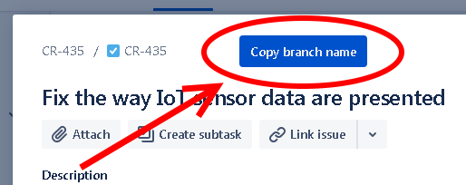
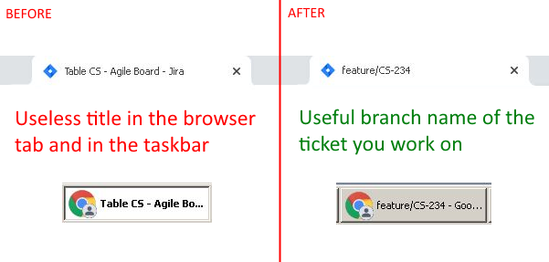

# JIRA: Copy branch name & ticket in the browser title

A JIRA extension that allows you to easily copy a branch name from a ticket.

- No GitHub, GitLab etc. integration needed
- No JIRA admin rights needed

## Features

1. Easily copy a branch name in GitFlow naming convention

2. See the branch name in your browser title and in toolbar

3. Easy to customise. It is pure, editable JavaScript

## How to use
1. Install 'Run JavaScript' extension (https://chrome.google.com/webstore/detail/run-javascript/lmilalhkkdhfieeienjbiicclobibjao?hl=en) for Chrome, or any other extension that allows you to run JavaScript in the browser
2. Open JIRA ticket
3. Paste code from jira-copy-branch-name.js into Run JavaScript window, and select 'Enable on <your website>' checkbox
4. Click Save and Run

## Expected result

Every time you open a JIRA ticket, next to the name there will be a button called 'Copy branch name'. It will prepare a branch name from the ticket number eg. 'feature/CR-182' and copy it to the clipboard. Now you can go to console and create your branch faster.

## Security

Validate the security of your browser, JS execution extension and your code to make sure, you won't copy and execute malcious script in your console.

## Become a patron

Become a patron for 3$ and receive amazing Patreon benefits:

https://www.patreon.com/tomaszs

## Contribution

You can commit a MR if you like

## Authors

Tomasz Smykowski (http://tomasz-smykowski.com)
